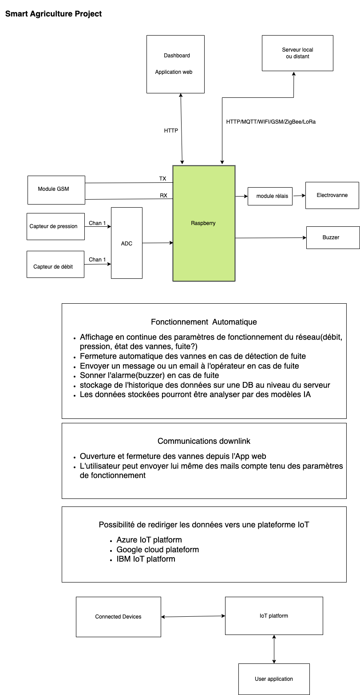
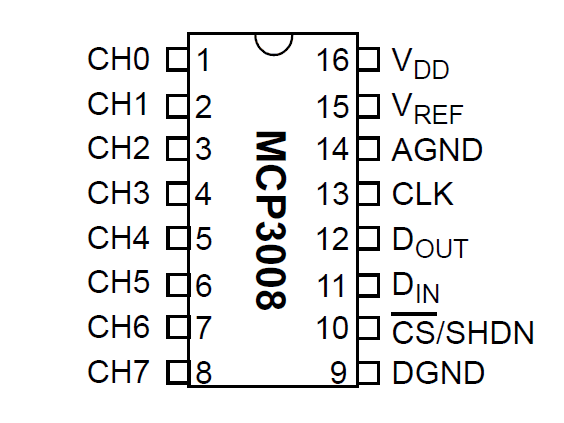
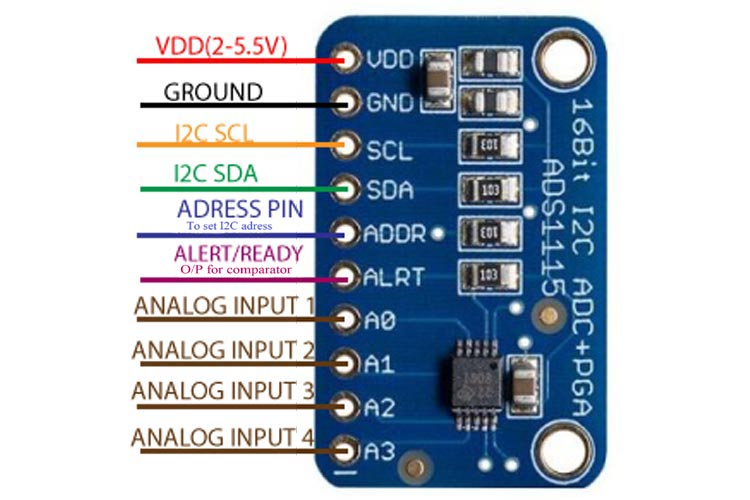

## Smart Agriculture Project



### Configurations

**Configure a python virtual environment on raspberry pi**
```
$ mkdir Smart_Agriculture
$ cd SmartAgriculture
$ python -m venv env1

#activate the virtual environment
$ source env1/bin/activate
```
**Libraries installation**
```
$ sudo apt-get update
$ sudo apt-get upgrade
$ pip install flask
```
### Analog to Digital Converter MCP008

It's a 8-channel 10-bit analog tio digital converter. The chip is great to read a simple analog signals like temperature. ADS1015 or ADS1115 give more precision or features  
We connect MCP008 to Raspberry by using SPI serial connection. 


[MCP008 Datasheet](http://www.adafruit.com/datasheets/MCP3008.pdf) 

**Hardware SPI: MCP008 Wiring**


### Analog to Digital Converter ADS1115




